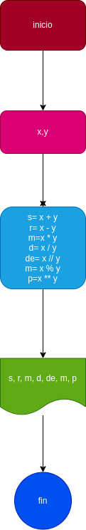

# Ejercicio N° 3

## Implementar un programa para calcular la suma, resta, multiplicacion, divicion, divicion entera, modulo y potencia

---
# ANALISIS

variables de entrada (imput)

 x & y: numeros naturales utilisados para sacar el resultado de las operaciones

 variables de proceso y salida (processing, storage, output)

 ---

 s: Suma

 r: Resta

 m: multiplicacion 

 d: Divicion

 de: Divicion entera

 mod: Modulo

 p: potencia

 ---
 # DISEÑO

 

 # CONSTRUCCION
